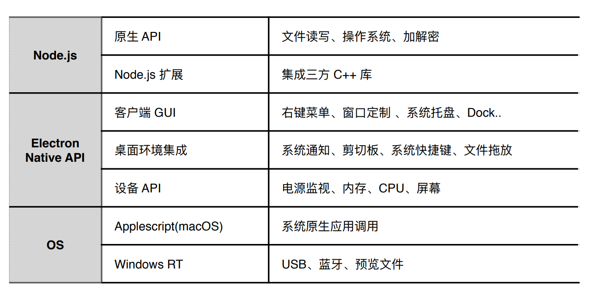

# electron 事件循环

 - chromium 集成到Node.js：用libuv 实现message pump(nw)
 - Node.js 集成到chromium

 # 为什么开发桌面端

 - 更快捷的入口
 - 离线可用
 - 调用系统能力（通知、硬件...）
 - 安全需求

 # 技术对比

 + 使用Native(C++/C#/OBJECT-C)开发
   - 高性能
   - 原生体验
   - 包体积小
   - 门槛高
   - 迭代速度慢

+ QT
    - 基于C++
    - 跨平台(Mac\Windows\IOS,Android\linux\嵌入式)
    - 高性能
    - 原声体验
    - 门槛高
    - 迭代速度一般

+ NW.js
  - 跨平台
  - 迭代快，web技术构建
  - 源码加密、支持chrome扩展
  - 不错的社区
  - 包体积大
  - 性能一般

+ Electron 
  - 跨平台（Mac\Windows\Linux\不支持XP）
  - web技术构建
  - 活跃的社区
  - 大型应用案例
  - 包体积大
  - 性能一般
  - 产品(Atom,slack,vscode,whatsapp,大象)

  
 # 技术准备

   - 编辑器 vscode
   - nvm 安装node
   - 安装electron

 # Electron 架构


## 主进程

 - Electron 运行`package.json`的 `main`脚本的进程被称为主进程
 - 每个应用只有一个主进程
 - 管理原生`GUI`,典型的窗口(`BrowserWindow`,`Tray`,`Dock`,`Menu`)
 - 获取底层能力：`clipboard`剪切板, `globalShortcut` 全局快捷键, `desktopCapture`获取桌面, `shell`打开文件、`URL`
 - 创建渲染进程
 - 控制应用生命周期(`app`)
 - 常用模块 `app`, `BrowserWindow`, `ipcMain`, `Menu`, `Tray`, `MenuItem`, `dialog`, `Notification`, `webContents`, `autoUpdater`, `globalShortcut`, `clipboard`, `crashReporter`,`shell`,`nativeImage`

 

## 渲染进程

 - 展示web页面的进程称为渲染进程
 - web页面运行在沙盒环境中，需要通过`Node.js`、`Electron` 提供的API跟系统底层交互
 - 一个`Electron`应用可以有多个渲染进程
 - 常用模块 `ipcRenderer`, `remote`, `desktopCapture`, `webFrame`, `clipboard`,`crashReporter`, `shell`

## :telephone_receiver: 通讯模式

+ 目的
    - 通知事件
    - 数据传输
    - 共享数据

+ IPC通信模块
   - 主进程 ipcMain
   - 渲染进程 ipcRenderer
   - ipcMain 和 ipcRenderer  都是EventEmitter对象

   + 用法

   > 渲染进程 -> 主进程

   ```javascript
   // callback写法
   
   // 渲染进程 发送
   ipcRenderer.send(channel,...args)

   // 主进程 监听
   ipcMain.on(channel,handler);
   ```

   ```javascript
   // promise 写法(Electron7.0之后,处理请求 + 响应模式)
   // 使用场景：和主进程通信后，希望能获取到返回结果

   // 渲染进程 发送
   ipcRenderer.invoke(channel,...args)

    // 主进程 监听
    ipcMain.handle(channel,handler);

   ```

   > 主进程 -> 渲染进程
   ```javascript

   // 主进程和渲染进程是一对多的关系：1 -> N
   // 所以需要找到具体的窗体内容（webContents）来发送给指定的渲染进程
   // 主进程 发送
   webContents.send(channel);

   // 渲染进程 监听
   ipcRenderer.on(channel,handler)
   ```

   > 渲染进程 -> 渲染进程
     + 通知事件
       - 通过主进程转发(`Electron5.0`之前)
       - ipcRenderer.sendTo(`Electron5.0`之后)
     + 数据共享
       - web技术(localStorage、sessionStorage、indexedDB)
    
    > 注意事项
     + 少用remote 模块
       - 每次使用`remote`会触发底层的同步IPC事件,对性能影响较大,有造成进程卡死的风险
     + 不要用`sync`模式
     + 在请求 + 响应的通信模式下，需要自定义超时限制

## 对比web开发的优势
    - 无浏览器兼容问题
    - 最新浏览器Feature
    - No PolyFill
    - Es 高级语法
    - 无跨域问题
    - Powered by Node.js
# :computer: 项目实战

  - 番茄时钟
    
    使用定时器分割出一个一般为25分钟工作时间和5分钟休息时间

    + 流程

       - 应用启动 -> 工作倒计时25分钟 -> 弹出交互通知，询问是否休息 -> 休息倒计时5分钟 -> 弹出通知
       
 # :rocket: 进阶

 ### 基础部分
* quick-start  https://electronjs.org/docs/tutorial/first-app 
* 基本架构 https://electronjs.org/docs/tutorial/application-architecture#main-and-renderer-processes 
* 写得很好的基础介绍 http://jlord.us/essential-electron/ 
* 掌握Electron模块。重点包括：app、BrowserWindow、ipcMain、Menu、Tray、ipcRenderer、Notification、clipboard
    * 通过api-demos可以快速看到效果 https://github.com/electron/electron-api-demos 
    * 查看文档 https://electronjs.org/docs 

### 工程部分
* 选择一个合适的模板
    * react https://github.com/electron-react-boilerplate/electron-react-boilerplate
    * vue https://github.com/SimulatedGREG/electron-vue
    * svelet https://github.com/Rich-Harris/svelte-template-electron
    * 纯JS https://github.com/dengyaolong/electron-boilerplate
* 更新 https://electronjs.org/docs/tutorial/updates
* 监控 https://electronjs.org/docs/api/crash-reporter
* 打包 & 分发 https://electronjs.org/docs/tutorial/application-distribution
* 安全 https://electronjs.org/docs/tutorial/security
* 单测 https://electronjs.org/docs/tutorial/automated-testing-with-a-custom-driver
* 持续集成 https://juejin.im/entry/5995599a6fb9a0249f6a131b

### 原理深入
* 了解Electron时间循环 https://electronjs.org/blog/electron-internals-node-integration
* 源码结构 https://electronjs.org/docs/development/source-code-directory-structure
* 与原生模块混合开发 https://electronjs.org/docs/tutorial/using-native-node-modules
* 性能调优 https://electronjs.org/docs/tutorial/performance


### 项目参考
* 源码
    * Atom https://github.com/atom/atom (架构清晰)
    * WebTorrent https://github.com/webtorrent/webtorrent (WebTorren就是纯JS写的，个人十分喜欢)
    * VSCode https://github.com/microsoft/vscode (大而全，可能比较难读)
* 实践经验
    * 美团 https://github.com/QConChina/QConBeijing2019/blob/master/%E5%89%8D%E7%AB%AF%E5%B7%A5%E7%A8%8B%E5%AE%9E%E8%B7%B5/Electron%20%E5%9C%A8%E4%BC%81%E4%B8%9A%20IM%20%E5%89%8D%E7%AB%AF%E5%B7%A5%E7%A8%8B%E5%AE%9E%E8%B7%B5-%E9%82%93%E8%80%80%E9%BE%99.pdf
    * 携程 https://www.infoq.cn/article/AwVS6Kxt-7LCIFVruF6d
    * https://cloud.tencent.com/developer/article/1558453
    * https://changkun.us/archives/2017/03/217/
    * https://webfe.kujiale.com/browser-to-client/