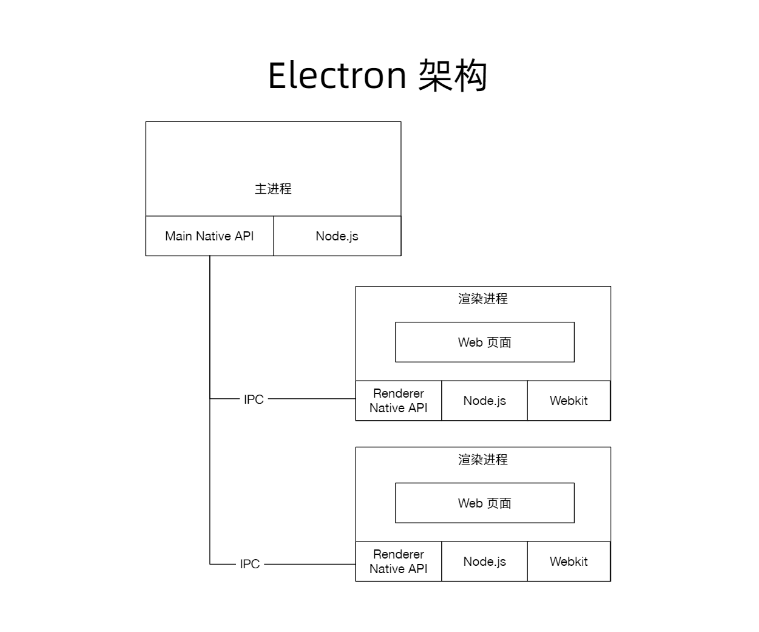

# electron 事件循环

 - chromium 集成到Node.js：用libuv 实现message pump(nw)
 - Node.js 集成到chromium

 # 为什么开发桌面端

 - 更快捷的入口
 - 离线可用
 - 调用系统能力（通知、硬件...）
 - 安全需求

 # 技术对比

 + 使用Native(C++/C#/OBJECT-C)开发
   - 高性能
   - 原生体验
   - 包体积小
   - 门槛高
   - 迭代速度慢

+ QT
    - 基于C++
    - 跨平台(Mac\Windows\IOS,Android\linux\嵌入式)
    - 高性能
    - 原声体验
    - 门槛高
    - 迭代速度一般

+ NW.js
  - 跨平台
  - 迭代快，web技术构建
  - 源码加密、支持chrome扩展
  - 不错的社区
  - 包体积大
  - 性能一般

+ Electron 
  - 跨平台（Mac\Windows\Linux\不支持XP）
  - web技术构建
  - 活跃的社区
  - 大型应用案例
  - 包体积大
  - 性能一般
  - 产品(Atom,slack,vscode,whatsapp,大象)

  
 # 技术准备

   - 编辑器 vscode
   - nvm 安装node
   - 安装electron

 # Electron 架构

## 主进程

 - Electron 运行`package.json`的 `main`脚本的进程被称为主进程
 - 每个应用只有一个主进程
 - 管理原生`GUI`,典型的窗口(`BrowserWindow`,`Tray`,`Dock`,`Menu`)
 - 创建渲染进程
 - 控制应用生命周期(`app`)

## 渲染进程

 - 展示web页面的进程称为渲染进程
 - web页面运行在沙盒环境中，需要通过`Node.js`、`Electron` 提供的API跟系统底层交互
 - 一个`Electron`应用可以有多个渲染进程

# 项目实战

  - 番茄时钟
    
    使用定时器分割出一个一般为25分钟工作时间和5分钟休息时间

    + 流程

       - 应用启动 -> 工作倒计时25分钟 -> 弹出交互通知，询问是否休息 -> 休息倒计时5分钟 -> 弹出通知
       